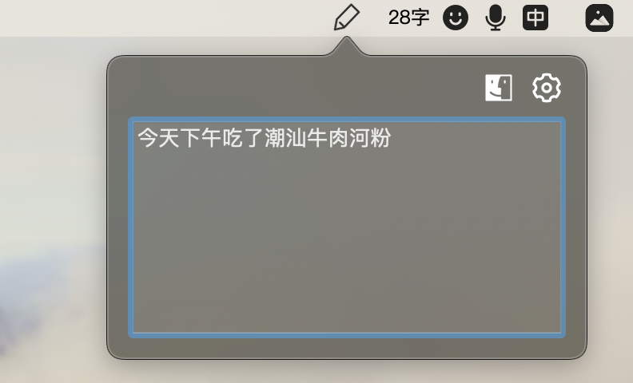
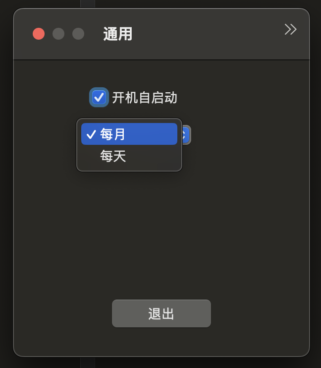
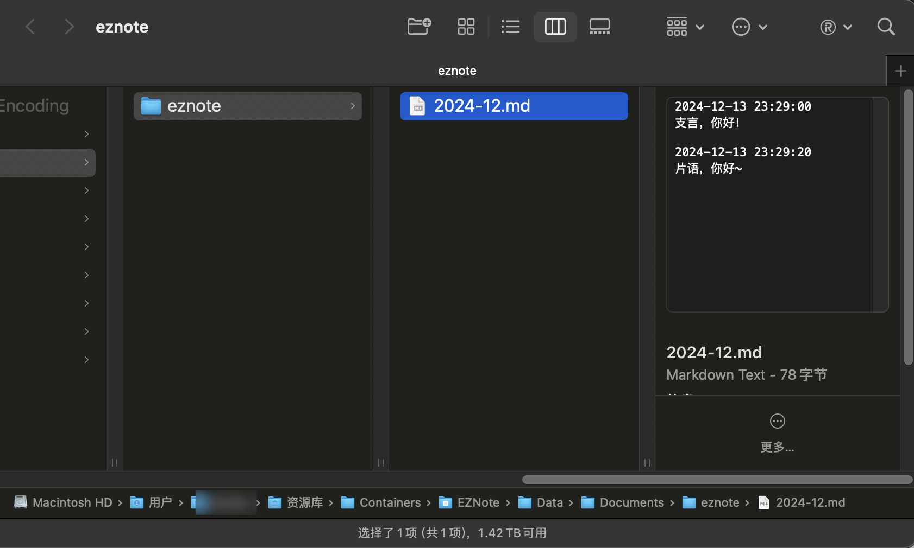

# 支言 EZNote
支言 EZNote - 状态栏随手笔记工具  macOS statusbar quick note tool  

个人用的简约轻量 macOS 随手笔记，目前没有更多的UI设计和功能，故无法上架 MAS，开放给有需要的人。欢迎贡献💐

***

## 主要功能说明

1、状态栏快速记录笔记

2、保存为 markdown 数据（后续可能增加 jsonl 保存方法）

3、开机自启动

***

### 界面说介绍

#### 状态栏

点击状态栏，输入文本，点击回车自动记录；

点击 设置按钮，进入设置界面；

点击文件夹按钮，打开保存文件所在文件夹。

应用在 Dock 栏不显示，不占用位置。只在状态栏可见。

    

***

#### 设置界面 

设置开机自启动，开机后，应用将在状态栏启动；

可设置记录周期，目前设置为 每月或每天，方便不同频率的使用。

    

***

#### 文件存储

    

***

### 隐私说明

1、本应用数据只保存在本地，不上传；

2、保存在应用沙盒下，不需要系统权限。保存目录：

`~/Library/Containers/com.ez.EZNote/Data/Documents/eznote `

***

## 其它

### 开发环境

macOS 14.3.1 (23D60)

Xcode 15.2 

pod 1.15.2 

***

### 来自身份不明的开发者

目前应用没有签名和公证，所以会弹出提示；点击`仍要打开` 即可。

    

***

